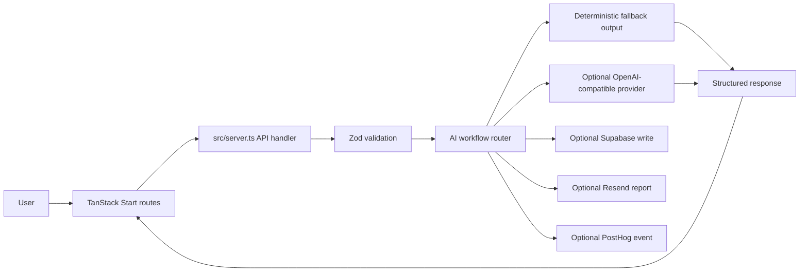

# Architect of Intelligence Architecture

Architect of Intelligence is an AI platform prototype for opportunity scanning, architecture generation, lead capture, and bilingual AI workflow output.

## System Flow

## Key Design Decisions

- Keep AI workflow contracts explicit with input and output schemas.
- Provide deterministic fallback behavior when optional integrations are unavailable.
- Separate server-only environment values from public client configuration.
- Support bilingual Arabic and English output as a first-class product requirement.

## Production Gaps

- Add integration tests for each AI workflow route.
- Add evaluation fixtures for AI output quality and schema adherence.
- Document Supabase schema ownership and migration expectations.
- Split deployment notes for Vercel and Cloudflare if both targets remain supported.
